# Transaction Patterns - Transfer

Mojaloop Third Party API

### Table Of Contents

1. [Preface](#Preface)  
    1.1 [Conventions Used in This Document](#ConventionsUsedinThisDocument)  
    1.2 [Document Version Information](#DocumentVersionInformation)  
    1.3 [References](#References)  
2. [Introduction](#Introduction)  
    2.1 [Third Party API Specification](#ThirdPartyAPISpecification)  
3. [Transfers](#Transfers)  
    3.1 [Discovery](#Discovery)  
    3.2 [Agreement](#Agreement)  
    3.3 [Transfer](#Transfer)  
4. [Request TransactionRequest Status](#RequestTransactionRequestStatus)  
5. [Error Conditions](#ErrorConditions)  
    5.1 [Bad Payee Lookup](#badpayeelookup)  
    5.2 [Bad Thirdparty Transaction Request](#badtptr)  
    5.3 [Downstream FSPIOP-API Failure](#downstreamapifailure)  
    5.4 [Invalid Signed Challenge](#invalidsignedchallenge)  
    5.5 [Thirdparty Transaction Request Timeout](#thirdpartytransactionrequesttimeout)  
6. [Appendix](#Appendix)  
    6.1 [Deriving the Challenge](#DerivingtheChallenge)  

#  1. <a id='Preface'></a>Preface

This section contains information about how to use this document.

##  1.1. <a id='ConventionsUsedinThisDocument'></a>Conventions Used in This Document

The following conventions are used in this document to identify the
specified types of information.

|Type of Information|Convention|Example|
|---|---|---|
|**Elements of the API, such as resources**|Boldface|**/authorization**|
|**Variables**|Italics with in angle brackets|_{ID}_|
|**Glossary terms**|Italics on first occurrence; defined in _Glossary_|The purpose of the API is to enable interoperable financial transactions between a _Payer_ (a payer of electronic funds in a payment transaction) located in one _FSP_ (an entity that provides a digital financial service to an end user) and a _Payee_ (a recipient of electronic funds in a payment transaction) located in another FSP.|
|**Library documents**|Italics|User information should, in general, not be used by API deployments; the security measures detailed in _API Signature and API Encryption_ should be used instead.|

##  1.2. <a id='DocumentVersionInformation'></a>Document Version Information

| Version | Date | Change Description |
| --- | --- | --- |
| **1.0** | 2021-10-03    | Initial Version

##  1.3. <a id='References'></a>References

The following references are used in this specification:

| Reference | Description | Version | Link |
| --- | --- | --- | --- |
| Ref. 1 | Open API for FSP Interoperability | `1.1` | [API Definition v1.1](https://github.com/mojaloop/mojaloop-specification/blob/master/fspiop-api/documents/v1.1-document-set/API%20Definition%20v1.1.md)|


#  2. <a id='Introduction'></a>Introduction

This document introduces the transaction patterns supported by the Third Party API relating
to the initiation of a Transaction Request from a PISP.

The API design and architectural style of this API are based on [Section 3](https://github.com/mojaloop/mojaloop-specification/blob/master/fspiop-api/documents/v1.1-document-set/API%20Definition%20v1.1.md#3-api-definition) of Ref 1. above.

##  2.1 <a id='ThirdPartyAPISpecification'></a>Third Party API Specification

The Mojaloop Third Party API Specification includes the following documents:

- [Data Models](./data-models.md)
- [Transaction Patterns - Linking](./transaction-patterns-linking.md)
- [Transaction Patterns - Transfer](./transaction-patterns-transfer.md)
- [Third Party Open API Definition - DFSP](./thirdparty-dfsp-v1.0.yaml)
- [Third Party Open API Definition - PISP](./thirdparty-dfsp-v1.0.yaml)


# <a id='Transfers'></a>3. Transfers

Transfers is broken down into the separate sections:
1. **Discovery**: PISP looks up the Payee Party to send funds to

2. **Agreement** PISP confirms the Payee Party, and looks up the terms of the transaction. If the User accepts the terms of the transaction, they sign the transaction with the credential established in the Linking API flow

3. **Transfer** The Payer DFSP initiates the transaction, and informs the PISP of the transaction result.

##  <a id='Discovery'></a>3.1 Discovery

In this phase, a user enters the identifier of the user they wish to send funds to. The PISP executes a **GET /parties/**_{Type}/{ID}_** (or **GET /parties/**_{Type}/{ID}/{SubId}_) call and awaits a callback from the Mojaloop switch. [Section 6.3](https://github.com/mojaloop/mojaloop-specification/blob/master/fspiop-api/documents/v1.1-document-set/API%20Definition%20v1.1.md#63-api-resource-parties)
of Ref 1. above describes the **/parties** resource in detail.

If the **GET /parties/**_{Type}/{ID}_ request is successful, the PISP will receive a **PUT /parties** callback from the Mojaloop switch. The PISP then confirms the Payee with their user.

Should the PISP receive a **PUT /parties/**_{Type}/{ID}_**/error** (or **PUT /parties/**_{Type}/{ID}/{SubId}_**/error**) callback, the PISP should display the relevant error to their user.


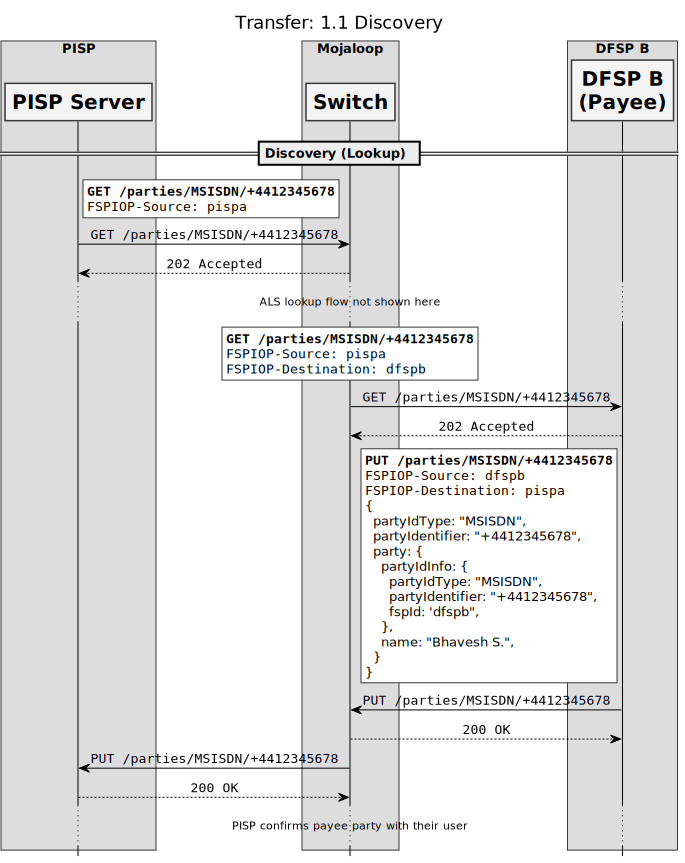

## <a id='Agreement'></a>3.2 Agreement

### <a id='thirdpartyTransactionRequest'></a>3.2.1 Thirdparty Transaction Request

Upon confirming the details of the Payee with their user, the PISP asks the user to enter the `amount` of funds they wish to send to the Payee, and whether or not they wish the Payee to _receive_ that amount, or they wish to _send_ that amount (`amountType` field).

If the User has linked more than 1 account with the PISP application, the PISP application can ask the user to choose an account they wish to send funds from. Upon confirming the _source of funds_ account, the PISP can determine:
1. the `FSPIOP-Destination` as the DFSP who the User's account is linked with
2. The `payer` field of the **POST /thirdpartyRequests/transactions** request body. The `partyIdType` is `THIRD_PARTY_LINK`, the `fspId` is the fspId of the DFSP who issued the link, and the `partyIdentifier` is the `accountId` specified in the **POST /consents#scopes** body. 

> See [Grant Consent](./transaction-patterns-linking.md#Grantconsent) for more information.

The PISP then generates a random `transactionRequestId` of type UUID (see [RFC 4122 UUID](https://tools.ietf.org/html/rfc4122)).

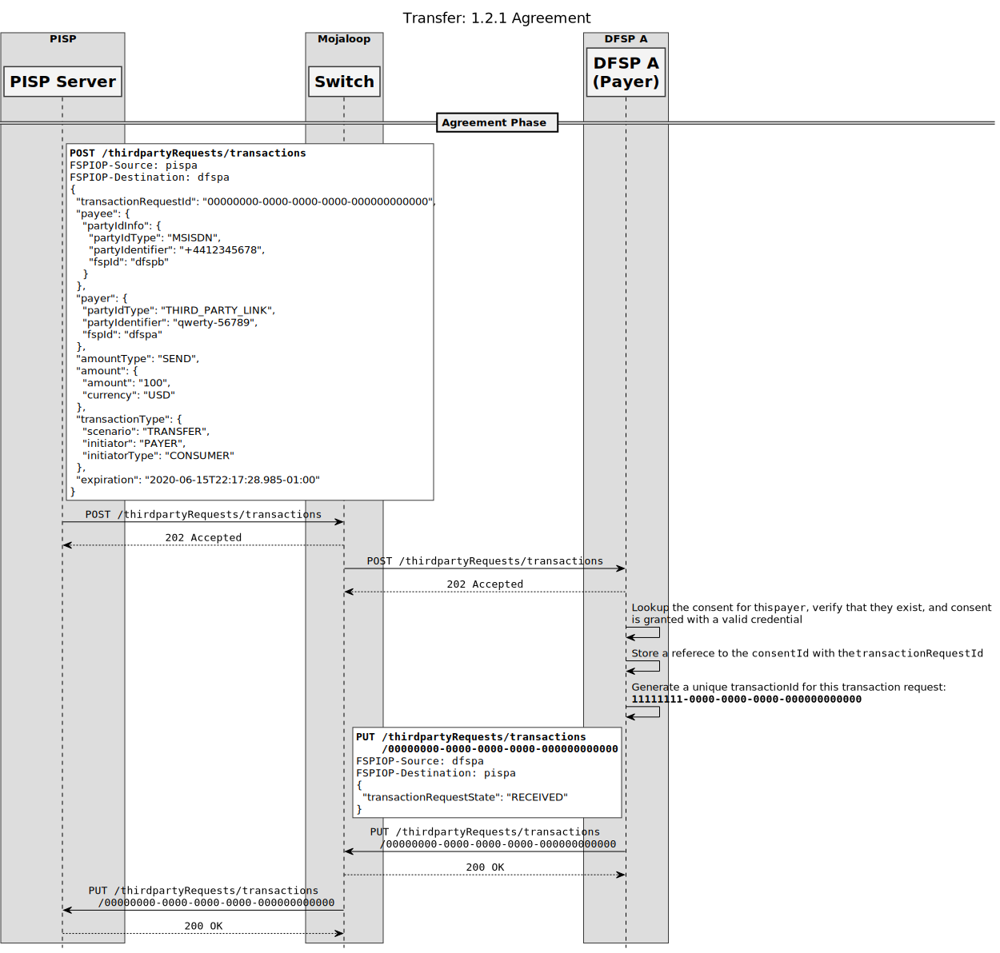

Upon receiving the **POST /thirdpartyRequests/transactions** call from the PISP, the DFSP performs some validation such as:
1. Determine that the `payer` identifier exists, and is one that was issued by this DFSP to the PISP specified in the `FSPIOP-Source`.
2. Confirms that the `Consent` that is identified by the `payer` identifier exists, and is valid.
3. Confirm that the User's account is active and holds enough funds to complete the transaction.
4. Any other validation that the DFSP wishes to do.

Should this validation succeed, the DFSP will generate a unique `transactionId` for the request, and call **PUT /thirdpartyRequests/transactions/**_{ID}_ with this `transactionId` and a `transactionRequestState` of `RECEIVED`. 

This call informs the PISP that the Thirdparty Transaction Request was accepted, and informs them of the final `transactionId` to watch for at a later date.

If the above validation fail, the DFSP should send a **PUT /thirdpartyRequests/transactions/**_{ID}_**/error** call to the PISP, 
with an error message communicating the failure to the PISP. See [Error Codes](./data-models.md#errorcodes) for more information.

### <a id='ThirdpartyAuthorizationRequest'></a>3.2.2 Thirdparty Authorization Request

The Payer DFSP (that is, the institution sending funds at the request of the PISP) may then issue a quotation request (**POST /quotes**) to the Payee DFSP (that is, the  institution receiving the funds). Upon receiving the **PUT /quotes/**_{ID}_ callback from the Payee DFSP, the Payer DFSP needs to confirm the details of the transaction with the PISP.

They use the API call **POST /thirdpartyRequests/authorizations**. The request body is populated with the following fields:

- `transactionRequestId` - the original id of the **POST /thirdpartyRequests/transactions**. Used by the PISP to correlate an Authorization Request to a Thirdparty Transaction Request
- `authorizationRequestId` - a random UUID generated by the DFSP to identify this Thirdparty Authorization Request 
- `challenge` - the challenge is a `BinaryString` which will be signed by the private key on the User's device. While the challenge 
could be a random string, we recommend that it be derived from something _meaningful_ to the actors involved in the transaction, 
that can't be predicted ahead of time by the PISP. See [Section 4.1](#DerivingtheChallenge) for an example of how the challenge
could be derived.
- `transactionType` the `transactionType` field from the original **POST /thirdpartyRequests/transactions** request


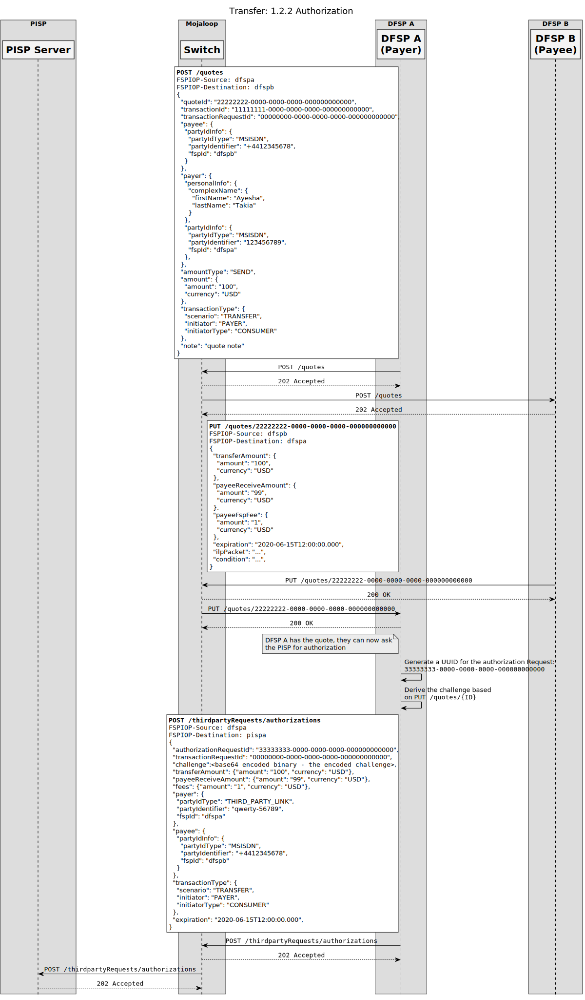


### <a id='SignedAuthorization'></a>3.2.3 Signed Authorization

Upon receiving the **POST /thirdpartyRequests/authorizations** request from the Payer DFSP, the PISP presents the terms of the proposed
transaction to the user, and asks them if they want to proceed. 

The results of the authorization request are returned to the DFSP via the **PUT /thirdpartyRequests/authorizations/**_{ID}_, where
the *{ID}* is the `authorizationRequestId`.


If the user rejects the transaction, the following is the payload sent in **PUT /thirdpartyRequests/authorizations/**_{ID}_:

```json
{
    "responseType": "REJECTED"
}
```

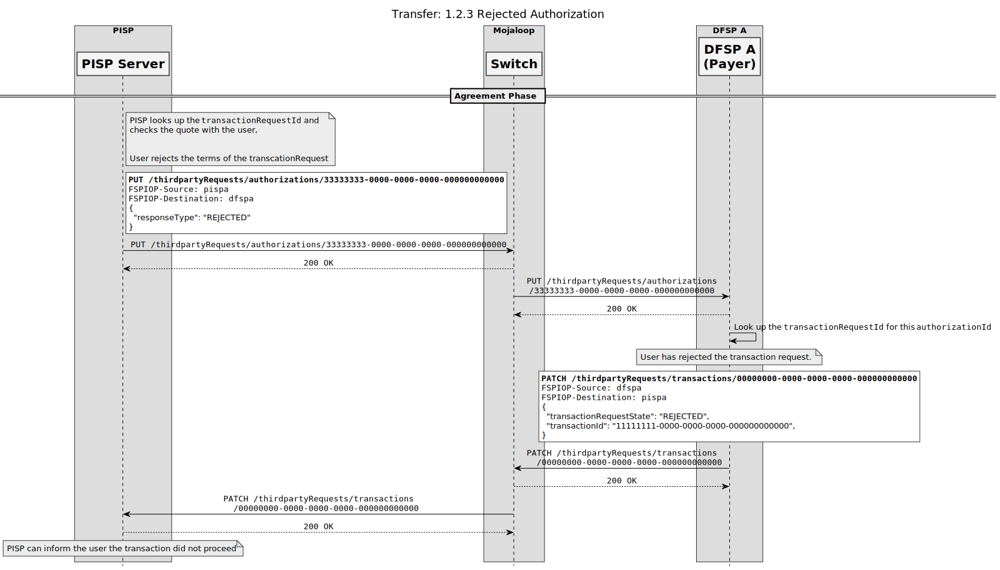


Should the user accept the transaction, the payload will depend on the `credentialType` of the `Consent.credential`:

1. If `FIDO`, the PISP asks the user to complete the [FIDO Assertion](https://webauthn.guide/#authentication) flow to sign the challenge. 
   The `signedPayload.fidoSignedPayload` is the `FIDOPublicKeyCredentialAssertion` returned from the FIDO Assertion process. See [3.2.3.1 Signing the Challenge FIDO](#SigningTheChallengeFIDO)

2. If `GENERIC`, the private key created during the [credential registration process](../linking/README.md#162-registering-the-credential) is
   used to sign the challenge. See [3.2.3.2 Signing the Challenge with a GENERIC Credential](#SigningTheChallengeGeneric)

#### <a id='SigningTheChallengeFIDO'></a>3.2.3.1 Signing the Challenge FIDO

For a `FIDO` `credentialType`, the PISP asks the user to complete the [FIDO Assertion](https://webauthn.guide/#authentication) flow to sign the challenge. The `signedPayload.value` is the [`PublicKeyCredential`](https://w3c.github.io/webauthn/#publickeycredential) returned from the FIDO Assertion process, where the `ArrayBuffer`s are parsed as base64 encoded utf-8 strings. As a `PublicKeyCredential` is the response of both the FIDO Attestation and Assertion, we define the following interface: `FIDOPublicKeyCredentialAssertion`:


```json
FIDOPublicKeyCredentialAssertion {
    "id": "string",
    "rawId": "string - base64 encoded utf-8",
    "response": {
        "authenticatorData": "string - base64 encoded utf-8",
        "clientDataJSON": "string - base64 encoded utf-8",
        "signature": "string - base64 encoded utf-8",
        "userHandle": "string - base64 encoded utf-8",
    },
    "type": "public-key"
}
```

The final payload of the **PUT /thirdpartyRequests/authorizations/**_{ID}_ is then:

```json
{
    "responseType": "ACCEPTED",
    "signedPayload": {
        "signedPayloadType": "FIDO",
        "fidoSignedPayload": FIDOPublicKeyCredentialAssertion
    }
}
```

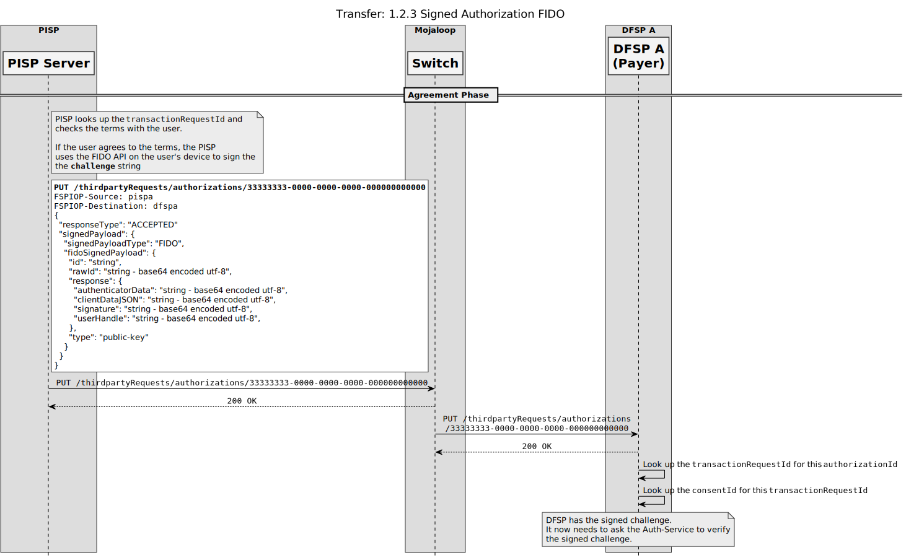


#### <a id='SigningTheChallengeGeneric'></a>3.2.3.2 Signing the Challenge with a GENERIC Credential

For a `GENERIC` credential, the PISP will perform the following steps:


1. Given the inputs:
    - `challenge` (`authorizationRequest.challenge`) as a base64 encoded utf-8 string
    - `privatekey` (stored by the PISP when creating the credential), as a base64 encoded utf-8 string
    - SHA256() is a one way hash function, as defined in [RFC6234](https://datatracker.ietf.org/doc/html/rfc6234)
    - sign(data, key) is a signature function that takes some data and a private key to produce a signature
2. _Let `challengeHash` be the result of applying the SHA256() function over the `challenge`_
3. _Let `signature` be the result of applying the sign() function to the `challengeHash` and `privateKey`_

The response from the PISP to the DFSP then uses this _signature_ as the `signedPayload.genericSignedPayload` field:


The final payload of the **PUT /thirdpartyRequests/authorizations/**_{ID}_ is then:

```json
{
    "responseType": "ACCEPTED",
    "signedPayload": {
        "signedPayloadType": "GENERIC",
        "genericSignedPayload": "utf-8 base64 encoded signature"
    }
}
```

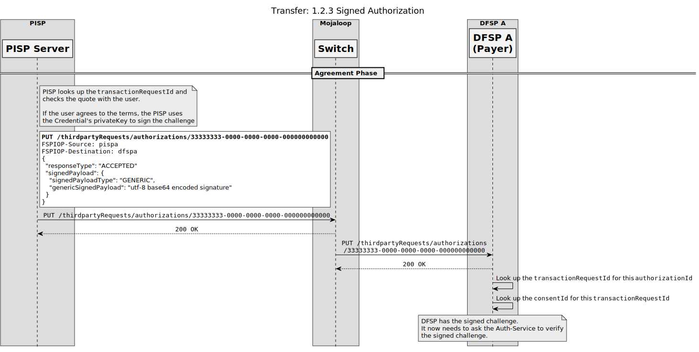


### <a id='ValidateAuthorization'></a>3.2.4 Validate Authorization

> __Note:__ If the DFSP uses a self-hosted authorization service, this step can be skipped.

The DFSP now needs to check that challenge has been signed correctly, and by the private key that corresponds to the 
public key that is attached to the `Consent` object.

The DFSP uses the API call **POST /thirdpartyRequests/verifications**, the body of which is comprised of:

- `verificationRequestId` - A UUID created by the DFSP to identify this verification request.
- `challenge` - The same challenge that was sent to the PISP in [3.2.2 Thirdparty Authorization Request](#ThirdpartyAuthorizationRequest)
- `consentId` - The `consentId` of the Consent resource that contains the credential public key with which to verify this transaction.
- `signedPayloadType` - The type of the SignedPayload, depending on the type of credential registered by the PISP
- `fidoValue` or `genericValue` - The corresponding field from the **PUT /thirdpartyRequests/authorizations** request body from the PISP.
The DFSP must lookup the `consentId` based on the `payer` details of the `ThirdpartyTransactionRequest`.

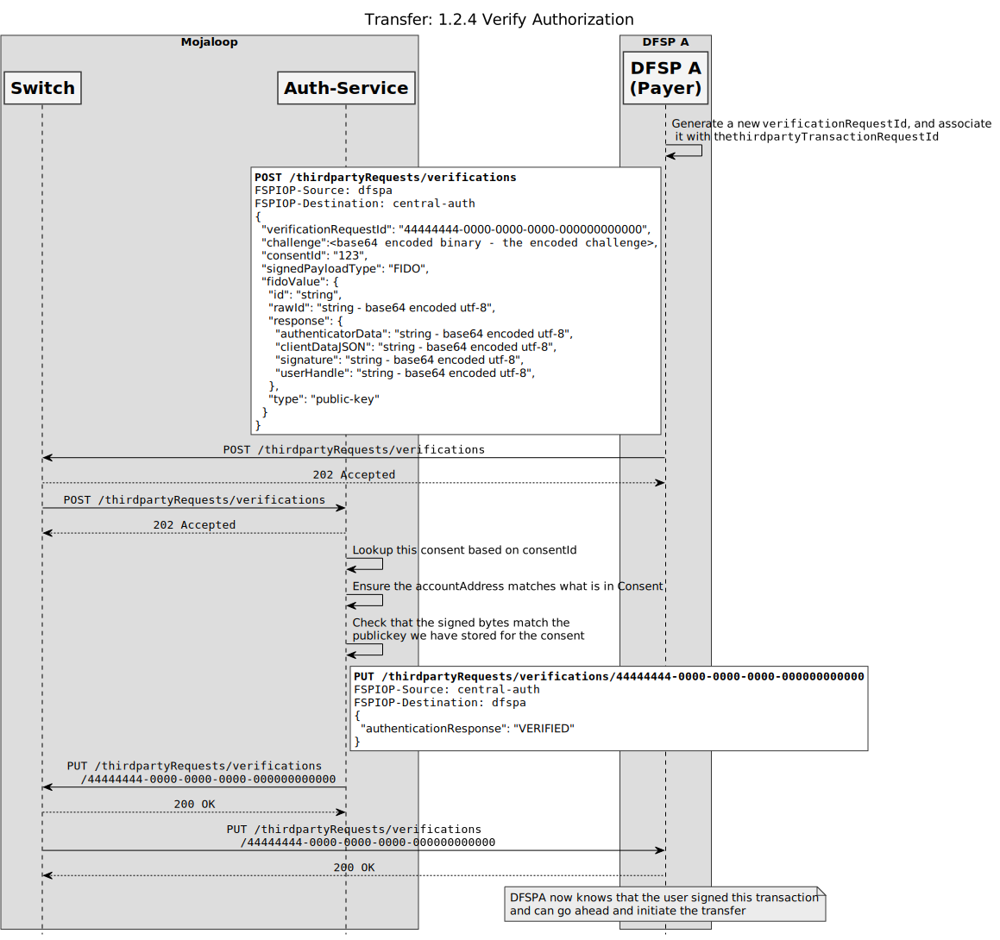

## <a id='Transfer'></a>3.3 Transfer

Upon validating the signed challenge, the DFSP can go ahead and initiate a standard Mojaloop Transaction using the FSPIOP API.

After receiving the **PUT /transfers/**_{ID}_ call from the switch, the DFSP looks up the ThirdpartyTransactionRequestId for the given transfer, 
and sends a **PATCH /thirdpartyRequests/transactions/**_{ID}_ call to the PISP.

Upon receiving this callback, the PISP knows that the transfer has completed successfully, and can inform their user.

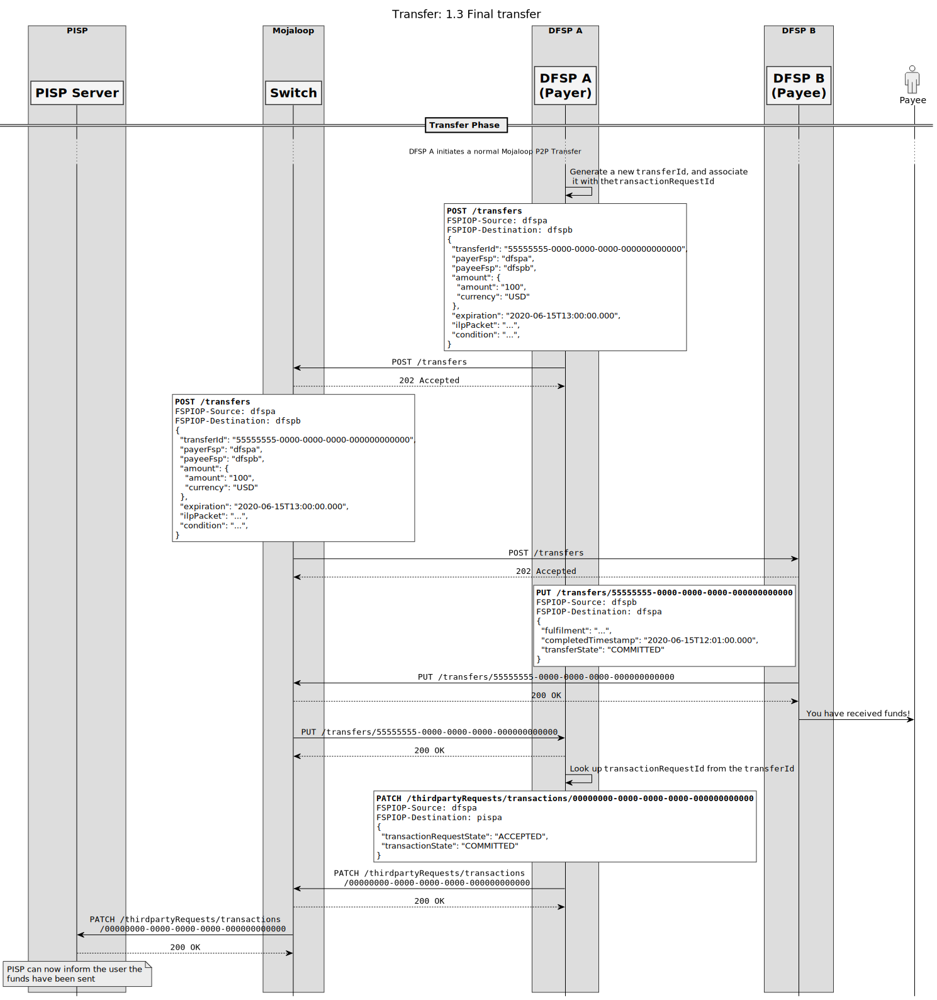


# <a id='RequestTransactionRequestStatus'></a>4. Request TransactionRequest Status

A PISP can issue a **GET /thirdpartyRequests/transactions/**_{ID}_ to find the status of a transaction request.

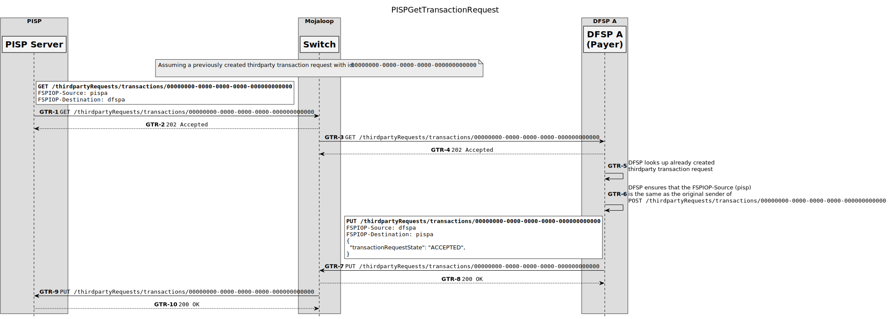

1. PISP issues a **GET /thirdpartyRequests/transactions/**_{ID}_
1. Switch validates request and responds with `202 Accepted`
1. Switch looks up the endpoint for `dfspa` for forwards to DFSP A
1. DFSPA validates the request and responds with `202 Accepted`
1. DFSP looks up the transaction request based on its `transactionRequestId`
    - If it can't be found, it calls **PUT /thirdpartyRequests/transactions/**_{ID}_**/error** to the Switch, with a relevant error message

1. DFSP Ensures that the `FSPIOP-Source` header matches that of the originator of the **POST /thirdpartyRequests/transactions**
    - If it does not match, it calls **PUT /thirdpartyRequests/transactions/**_{ID}_**/error** to the Switch, with a relevant error message

1. DFSP calls **PUT /thirdpartyRequests/transactions/**_{ID}_ with the following request body:
    ```
    {
      transactionRequestState: TransactionRequestState
    }
    ```

    Where `transactionId` is the DFSP-generated id of the transaction, and `TransactionRequestState` is `RECEIVED`, `PENDING`, `ACCEPTED`, `REJECTED`, as defined in [7.5.10 TransactionRequestState](https://github.com/mojaloop/mojaloop-specification/blob/master/fspiop-api/documents/v1.1-document-set/API%20Definition%20v1.1.md#7510-transactionrequeststate) of the API Definition


1. Switch validates request and responds with `200 OK`
1. Switch looks up the endpoint for `pispa` for forwards to PISP
1. PISP validates the request and responds with `200 OK`

# <a id='ErrorConditions'></a>5. Error Conditions

After the PISP initiates the Thirdparty Transaction Request with **POST /thirdpartyRequests/transactions**, the DFSP must send either a **PUT /thirdpartyRequests/transactions/**_{ID}_**/error** or **PATCH /thirdpartyRequests/transactions/**_{ID}_ callback to inform the PISP of a final status to the Thirdparty Transaction Request.

- **PATCH /thirdpartyRequests/transactions/**_{ID}_ is used to inform the PISP of the final status of the Thirdparty Transaction Request. This could be either a Thirdparty Transaction Request that was rejected by the user, or a Thirdparty Transaction Request that was approved and resulted in a successful transfer of funds.
- **PUT /thirdpartyRequests/transactions/**_{ID}_**/error** is used to inform the PISP of a failed Thirdparty Transaction Request.
- If a PISP doesn't receive either of the above callbacks within the `expiration` DateTime specified in the **POST /thirdpartyRequests/transactions**, it can assume the Thirdparty Transaction Request failed, and inform their user accordingly


## <a id='badpayeelookup'></a> 5.1 Unsuccessful Payee Lookup

When the PISP performs a Payee lookup (**GET /parties/**_{Type}/{ID}_), they may receive the callback **PUT /parties/**_{Type}/{ID}_**/error**. 

See [6.3.4 Parties Error Callbacks](https://docs.mojaloop.io/mojaloop-specification/documents/API%20Definition%20v1.0.html#634-error-callbacks) of the FSPIOP API Definition for details on how to interpret use this error callback.

In this case, the PISP may wish to display an error message to their user informing them to try a different identifier, or try again at a later stage.
## <a id='badtptr'></a> 5.2 Bad Thirdparty Transaction Request

When the DFSP receives the **POST /thirdpartyRequests/transactions** request from the PISP, the following processing or validation errors may occur:
1. The `payer.partyIdType` or `payer.partyIdentifier` is not valid, or not linked with a valid **Consent** that the DFSP knows about
2. The user's account identified by `payer.partyIdentifier` doesn't have enough funds to complete the transaction
3. The currency specified by `amount.currency` is not a currency that the user's account transacts in
4. `payee.partyIdInfo.fspId` is not set - it's an optional property, but payee fspId will be required to properly address quote request
5. Any other checks or verifications of the transaction request on the DFSP's side fail

In this case, the DFSP must inform the PISP of the failure by sending a **PUT /thirdpartyRequests/transactions/**_{ID}_**/error** callback to the PISP.

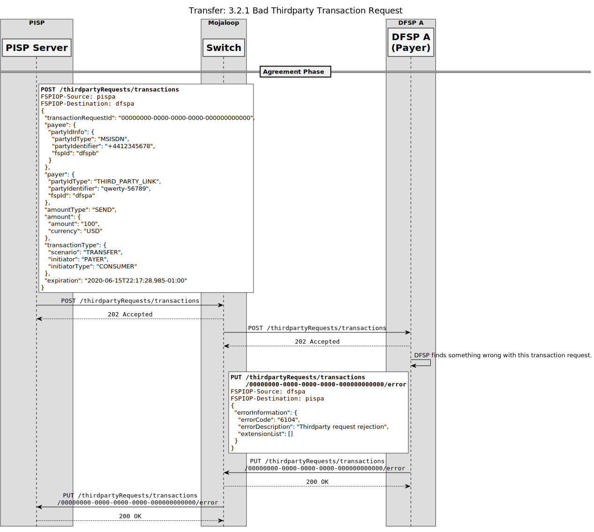

The PISP can then inform their user of the failure, and can ask them to restart the Thirdparty Transaction request if desired.


## <a id='downstreamapifailure'></a> 5.3 Downstream FSPIOP-API Failure

The DFSP may not want to (or may not be able to) expose details about downstream failures in the FSPIOP API to PISPs.

For example, before issuing a **POST /thirdpartyRequests/authorizations** to the PISP, if the **POST /quotes** call with the Payee FSP fails, the DFSP sends a **PUT /thirdpartyRequests/transactions/**_{ID}_**/error** callback to the PISP.

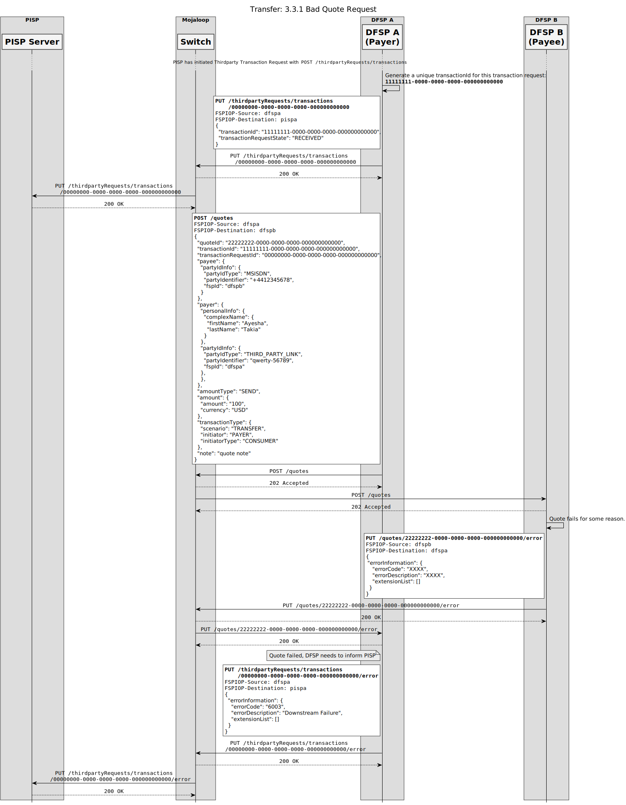

Another example is where the **POST /transfers** request fails:

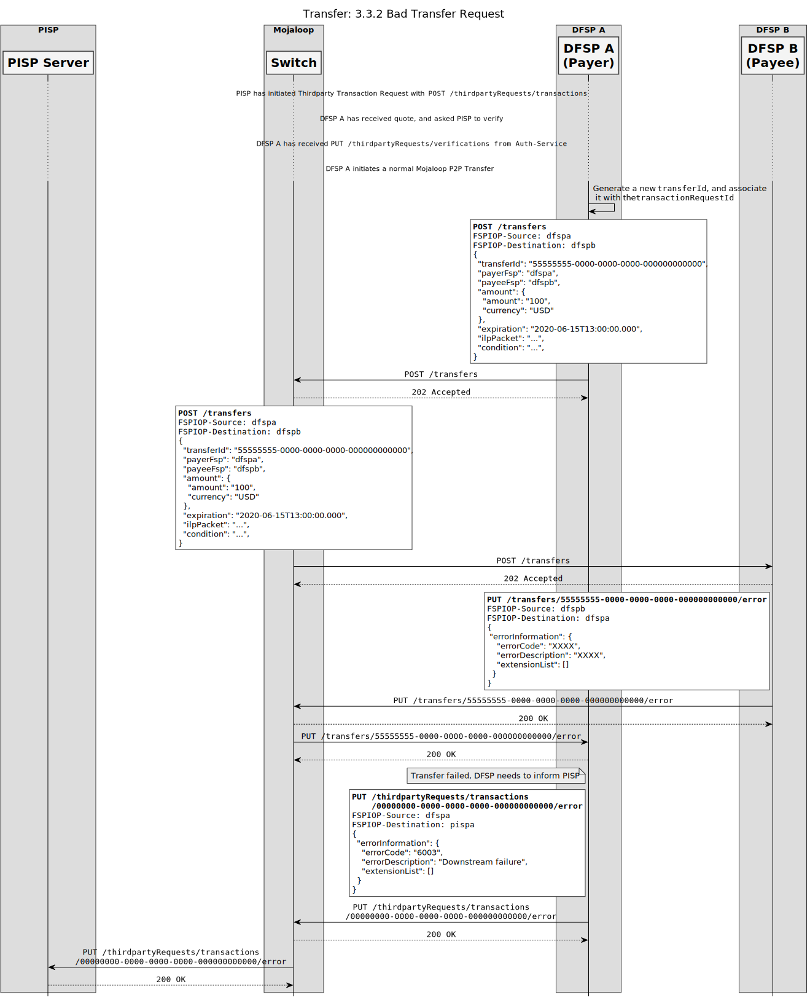


## <a id='invalidsignedchallenge'></a> 5.4 Invalid Signed Challenge

After receiving a **POST /thirdpartyRequests/authorizations** call from the DFSP, the PISP asks the user to sign the `challenge` using the credential that was registered during the account linking flow. 

The signed challenge is returned to the DFSP with the call **PUT /thirdpartyRequest/authorizations/**_{ID}_. 

The DFSP either:
1. Performs validation of the signed challenge itself
2. Queries the Auth-Service with  the **thirdpartyRequests/verifications** resource to check the validity of the signed challenge against the publicKey registered for the Consent.

Should the signed challenge be invalid, the DFSP sends a **PUT /thirdpartyRequests/transactions/**_{ID}_**/error** callback to the PISP.


### Case 1: DFSP self-verifies the signed challenge

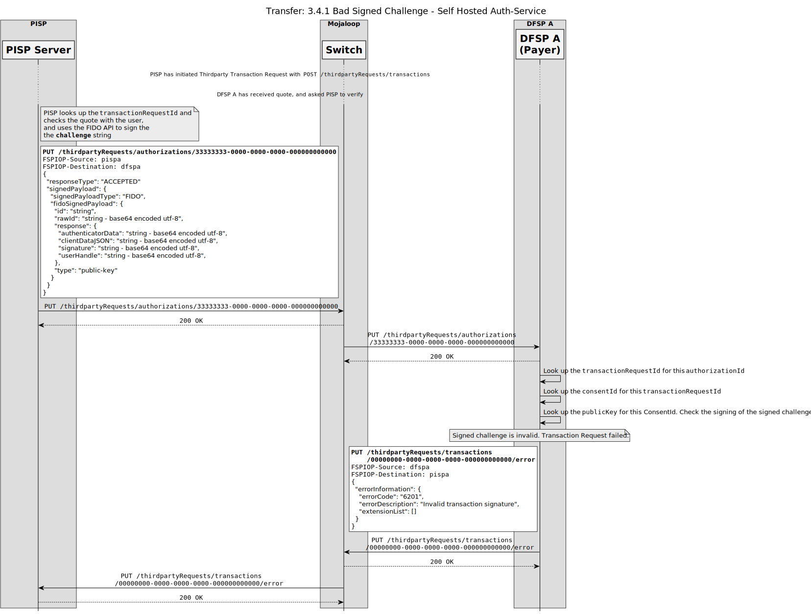


### Case 2: DFSP uses the hub-hosted Auth-Service to check the validity of the signed challenge against the registered credential.

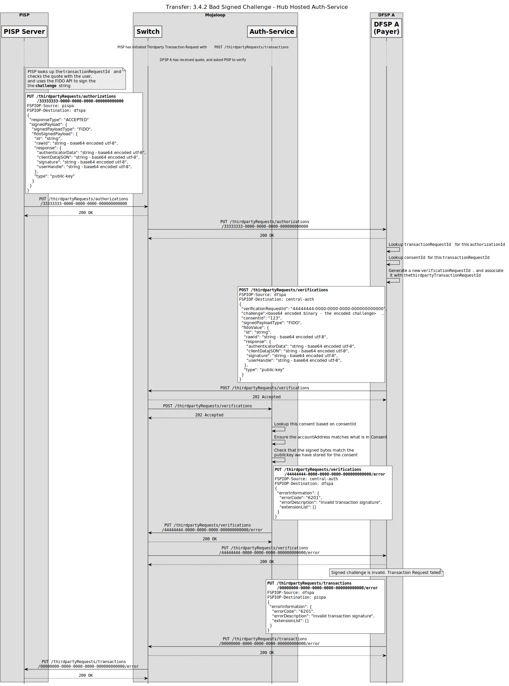

## <a id='thirdpartytransactionrequesttimeout'></a> 5.5 Thirdparty Transaction Request Timeout

If a PISP doesn't receive either of the above callbacks within the `expiration` DateTime specified in the **POST /thirdpartyRequests/transactions**, it can assume the Thirdparty Transaction Request failed, and inform their user accordingly.


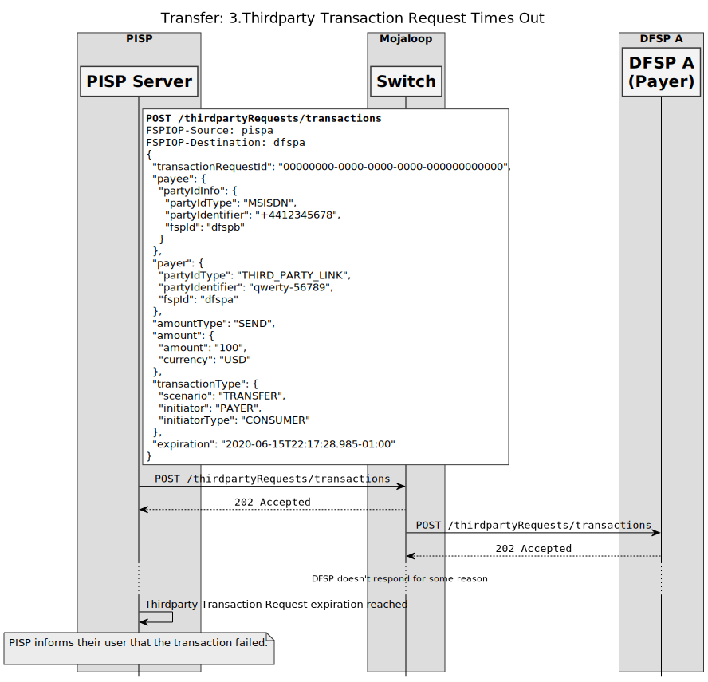

# <a id='Appendix'></a>6. Appendix

## <a id='DerivingtheChallenge'></a>6.1 Deriving the Challenge

1. _Let `quote` be the value of the response body from the **PUT /quotes/**_{ID}_ call_
2. _Let the function `CJSON()` be the implementation of a Canonical JSON to string, as specified in [RFC-8785 - Canonical JSON format](https://tools.ietf.org/html/rfc8785)_
3. _Let the function `SHA256()` be the implementation of a SHA-256 one way hash function, as specified in [RFC-6234](https://tools.ietf.org/html/rfc6234)_
4. The DFSP must generate the value `jsonString` from the output of `CJSON(quote)`
5. The `challenge` is the value of `SHA256(jsonString)`