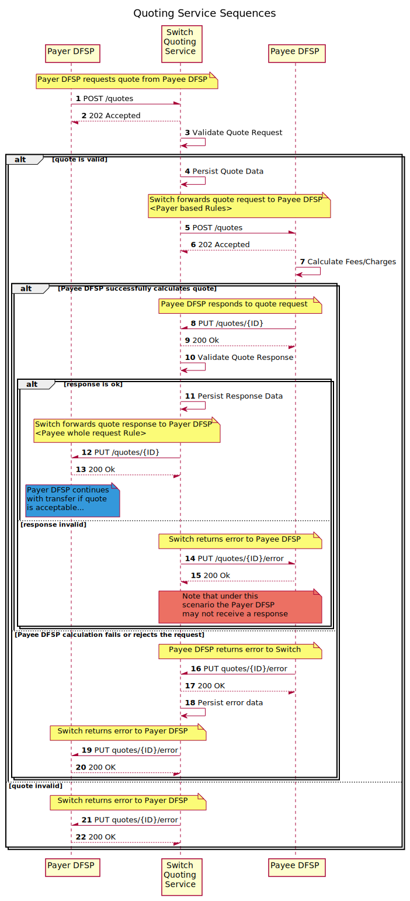

# Quoting Service Overview
The **Quoting Service** (**QS**) _(refer to section `5.1`) as per the [Mojaloop  {{ $page.frontmatter.version }} Specification](/api) implements the quoting phase of the various use-cases.

_Note: In addition to individual quotes, the quoting service supports bulk quotes as well._

## Sequence Diagram

