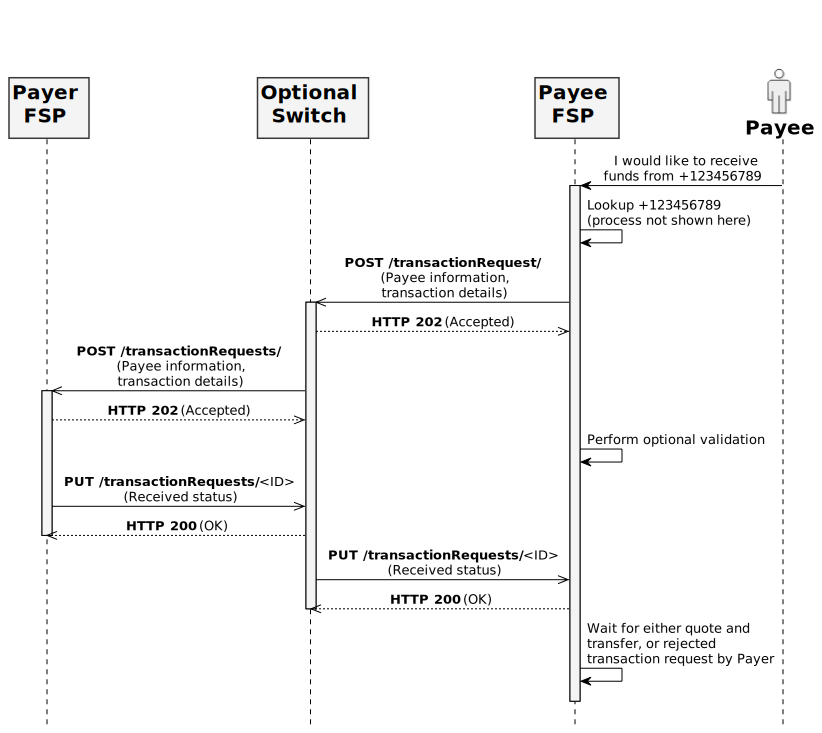

# Transaction Requests Service

## Sequence Diagram

* The transaction-requests-service is a mojaloop core service that enables Payee initiated use cases such as "Merchant Request to Pay".
* This is a pass through service which also includes Authorizations.
